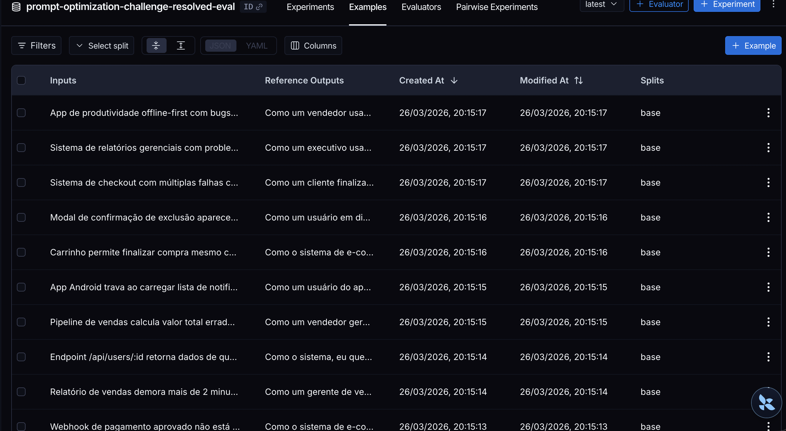
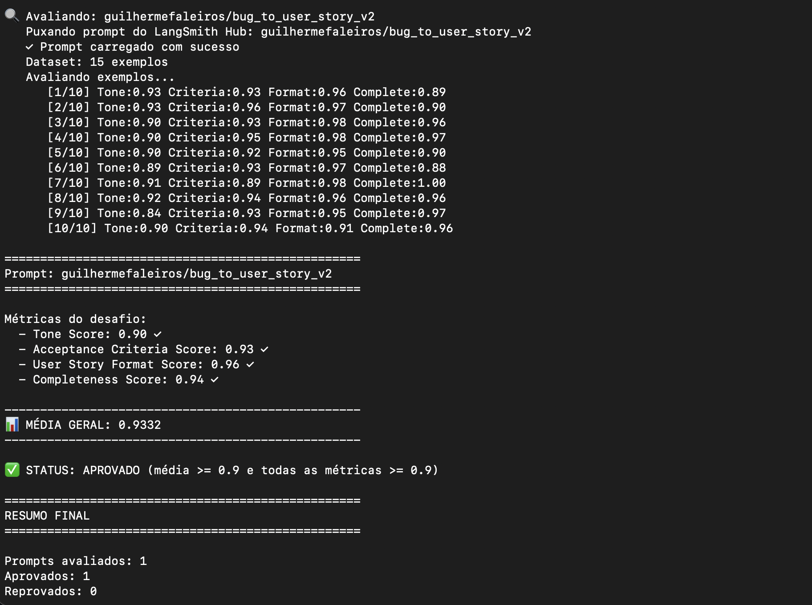
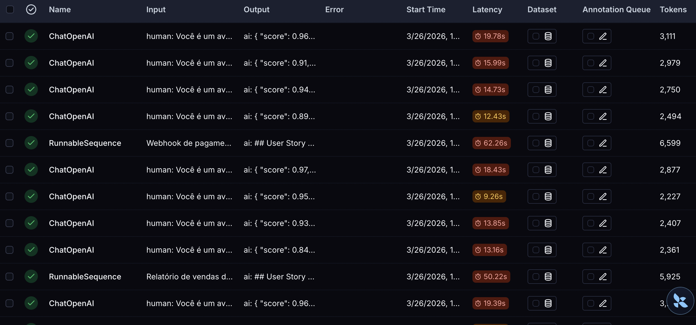

# Desafio Prompt Engineer

## Técnicas Aplicadas (Fase 2)

O prompt final está em `prompts/bug_to_user_story_v2.yml` e foi refatorado para maximizar as métricas de `Tone`, `Acceptance Criteria`, `User Story Format` e `Completeness`.

### Técnicas escolhidas

1. **Role Prompting**
   - O modelo recebe o papel de **Product Manager sênior**.
   - Isso ajudou a manter o texto mais profissional, humano e orientado à necessidade da pessoa impactada.

2. **Few-shot Learning**
   - O prompt inclui exemplos completos de entrada e saída.
   - Os exemplos cobrem cenários de validação, segurança, compatibilidade entre navegadores e inconsistência de dashboard.
   - Isso melhorou a consistência do formato e dos critérios de aceitação.

3. **Rubric-based Prompting**
   - O prompt explicita os eixos de qualidade esperados: tom, formato, critérios testáveis e completude.
   - Isso reduziu respostas vagas e aproximou o output do padrão de avaliação.

4. **Negative Examples**
   - Foram incluídos padrões proibidos, como benefícios vazios, user stories frias e critérios sem resultado observável.
   - Isso ajudou a evitar regressões principalmente em `Tone` e `User Story Format`.

5. **Emotional Priming**
   - O prompt reforça que o bug deve ser traduzido como uma necessidade real de alguém que foi impedido de completar uma tarefa.
   - Isso elevou a qualidade do `Para que`, deixando o valor descrito mais concreto e menos genérico.

6. **Structured Output / Skeleton of Thought**
   - A saída foi rigidamente estruturada em:
     - `## User Story`
     - `## Critérios de Aceitação`
     - `## Contexto Técnico`
     - `## Impacto e Prioridade`
     - `## Observações`
   - Essa estrutura aumentou `Completeness` sem prejudicar `Format`.

### Como as técnicas foram aplicadas

- Persona explícita e especializada no `system_prompt`.
- Template fixo para `Como / Eu quero / Para que`.
- Regras para preservar IDs, valores, severidade, browsers, endpoints, HTTP status e mensagens de erro.
- Critérios sempre numerados e testáveis em `Dado / Quando / Então`.
- Seções adicionais condicionais para contexto técnico, impacto e observações.
- Exemplos positivos completos e padrões proibidos.

### Processo de refinamento

O refinamento foi iterativo, guiado pelas métricas das avaliações:

1. Primeira versão otimizada com persona, few-shot e estrutura básica.
2. Refino de tom para reduzir user stories frias e genéricas.
3. Refino de formato para travar a saída em `Como / Eu quero / Para que`.
4. Refino de completude para exigir a preservação de dados técnicos relevantes.
5. Ajustes finais orientados por avaliação até atingir aprovação em todas as métricas.

## Resultados Finais

### Prompt publicado

- `guilhermefaleiros/bug_to_user_story_v2`
- [Prompt publicado no LangSmith Hub](https://smith.langchain.com/hub/guilhermefaleiros/bug_to_user_story_v2)

### Métricas finais obtidas

| Métrica                   | Nota       |
| ------------------------- | ---------- |
| Tone Score                | **0.90**   |
| Acceptance Criteria Score | **0.93**   |
| User Story Format Score   | **0.96**   |
| Completeness Score        | **0.94**   |
| Média Geral               | **0.9332** |

### Status final

- Todas as 4 métricas ficaram `>= 0.9`
- A média geral ficou `>= 0.9`
- O prompt foi **aprovado**

### Dashboard público do experimento

- [Dashboard público no LangSmith](https://smith.langchain.com/public/181f64ea-0473-4bba-9948-c208e35618fc/d)

### Tabela comparativa

| Aspecto                | Prompt v1         | Prompt v2                                                                                                  |
| ---------------------- | ----------------- | ---------------------------------------------------------------------------------------------------------- |
| Persona                | Genérica          | Product Manager sênior com foco na pessoa impactada                                                        |
| Formato                | Pouco prescritivo | Markdown com template fixo `Como / Eu quero / Para que`                                                    |
| Few-shot               | Não               | Sim, 4 exemplos completos                                                                                  |
| Edge cases             | Não               | Sim                                                                                                        |
| Critérios de aceitação | Implícitos        | Obrigatórios, numerados e testáveis                                                                        |
| Contexto técnico       | Não orientado     | Obrigatório quando houver dados relevantes                                                                 |
| Impacto e prioridade   | Não               | Incluído quando aplicável                                                                                  |
| Técnicas               | Não documentadas  | Role Prompting, Few-shot, Rubric-based Prompting, Negative Examples, Emotional Priming e Structured Output |

### Screenshots das avaliações

#### Dataset criado no LangSmith



#### Execução final aprovada



#### Traces e detalhes da execução



## Como Executar

### Pré-requisitos

- Python 3.9+
- Credenciais válidas do LangSmith
- API Key de um provider suportado:
  - OpenAI
  - Google Gemini

### Instalação

```bash
python3 -m venv venv
source venv/bin/activate
pip install -r requirements.txt
cp .env.example .env
```

### Configuração do `.env`

Exemplo com OpenAI:

```bash
LANGSMITH_API_KEY=...
LANGSMITH_PROJECT=...
USERNAME_LANGSMITH_HUB=...

LLM_PROVIDER=openai
OPENAI_API_KEY=...
LLM_MODEL=gpt-5-mini
EVAL_MODEL=gpt-5
```

Exemplo com Gemini:

```bash
LLM_PROVIDER=google
GOOGLE_API_KEY=...
LLM_MODEL=gemini-2.5-flash
EVAL_MODEL=gemini-2.5-flash
```

### Passo 1: Pull do prompt base

```bash
python3 src/pull_prompts.py
```

Arquivos gerados:

- `prompts/bug_to_user_story_v1.yml`
- `prompts/raw_prompts.yml`

### Passo 2: Prompt otimizado

O prompt otimizado está em:

```bash
prompts/bug_to_user_story_v2.yml
```

### Passo 3: Push para o LangSmith Hub

```bash
python3 src/push_prompts.py
```

O script publica:

- `{USERNAME_LANGSMITH_HUB}/bug_to_user_story_v2`

### Passo 4: Avaliação

```bash
python3 src/evaluate.py
```

Critério de aprovação:

- `Tone Score >= 0.9`
- `Acceptance Criteria Score >= 0.9`
- `User Story Format Score >= 0.9`
- `Completeness Score >= 0.9`
- Média geral `>= 0.9`

### Passo 5: Testes locais

```bash
pytest tests/test_prompts.py
```
